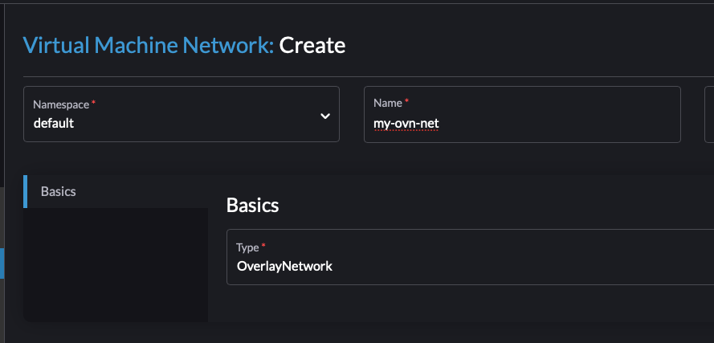
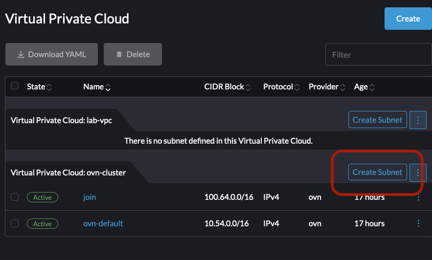
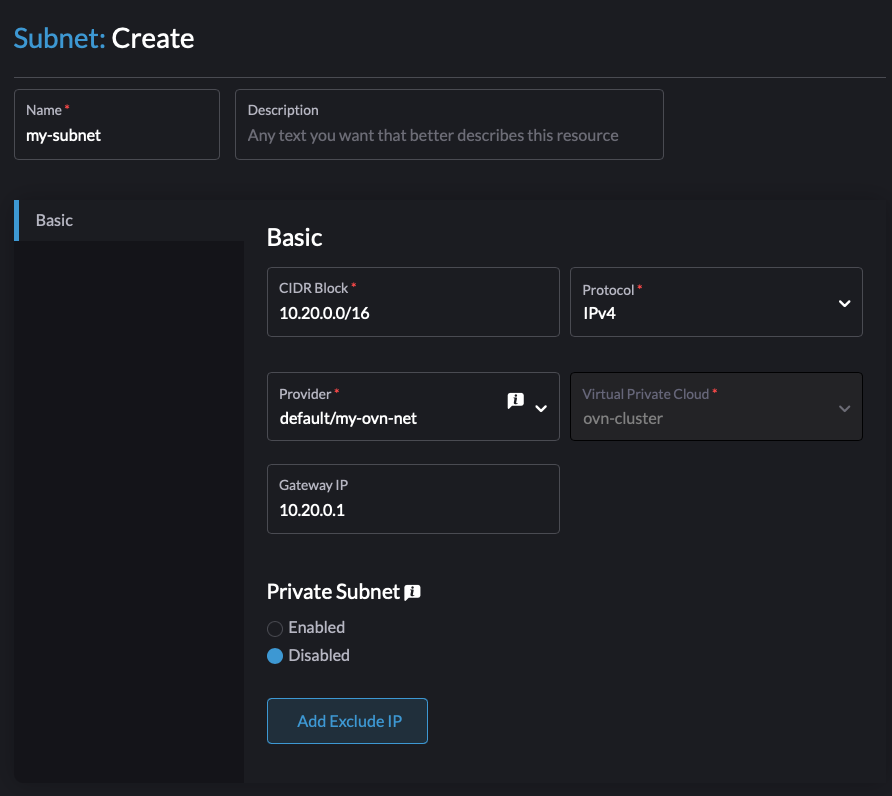
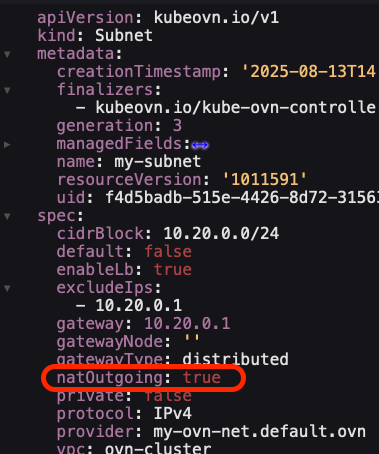
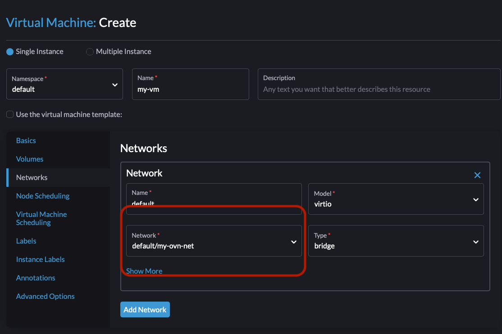
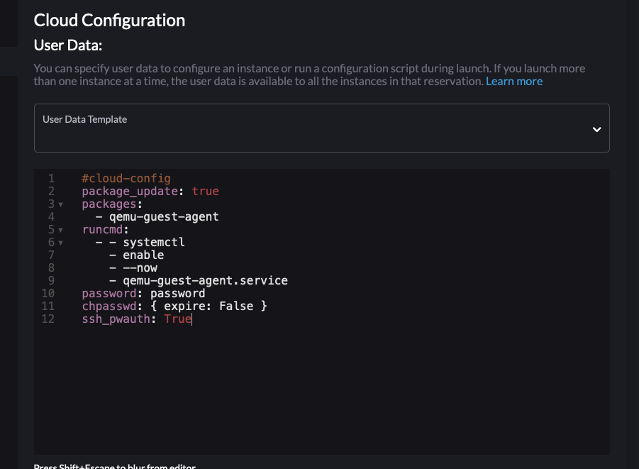
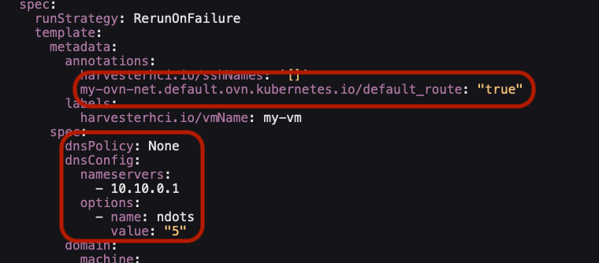
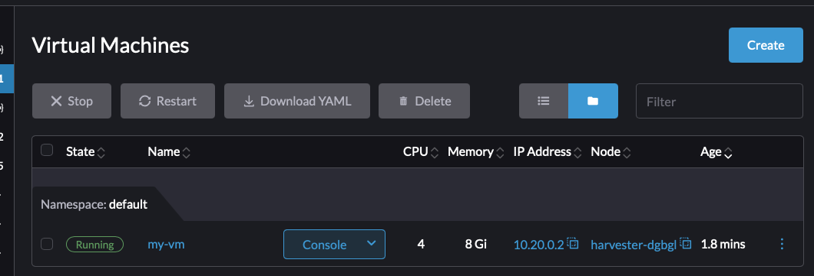

# Running a VM on a Custom Subnet using default VPC

This example will create a subnet with an IP address range and run a VM on top of it. It will show a configuration of DHCP that works within the subnet cidr range and then can be reached from the Layer2 network.

---
**WARNING** 

**I am not here as a representative of RGS or SUSE. Neither are the contributors to this repo.
None of these examples provided are in any way supported or implied to be supported by RGS or SUSE. These are here purely for educational purposes and example-driven learning for the Kubeovn deployment on Harvester. If you're interested in building supportable examples, please consult with your assigned SA or RGS or SUSE contacts.**

**END WARNING**

---

## Versions Tested

Current `Harvester` Version: `v1.6.0-RC5`

Tested `Harvester` Versions: 
* `v1.6.0-RC5`

`Kubeovn Operator` Versions: 
* `v1.13.5-rc4`

## Issues

* DHCP is currently broken [Issue here](https://github.com/harvester/harvester/issues/8847). This can be worked around and will be documented in this use-case

## Implementation

* Create `VM Network` (Network Attachment Definition) within Harvester as an `OverlayNetwork`
* Create new `Subnet` referencing `VM Network`
* Create VM on `OverlayNetwork`
* Confirm VM gets IP and can resolve DNS plus reach `google.com`

## Requirements or Helpful links

* Cloud-image from your vendor of choice, this example uses SLE Micro 6.1 as it has `cloud-init`, pre 6.0 versions cannot run as cloud-images without adding it in first (Ignition isn't a cloud-native or industry-standard orchestration tool)
* This use-case is performed on a set of bare metal devices but should also work on a Virtual Harvester, though you will need to handle the nested VM

## Install

Creating the VM requires a few steps. Two different paths exist, clickops vs `kubectl apply`. We'll save the validation step to after both paths being defined.

### ClickOps Mode (manual)

Create your VM Network. Underhood this creates an overlay provider that is currently required by your Subnet prior to creation. Mine is called `my-ovn-net`.


Create a Subnet within the `ovn-cluster` VPC:


Define Subnet CIDR. My example is using `10.20.0.0/24` with a gateway of `10.20.0.1` and I tie it to the `OverlayNetwork` I just created as the provider. These IP ranges are not managed or routable within my upstream gateway/router that manages my Harvester nodes. This is entirely virtual and does not use VLANs at all.


Unfortunately, as of Harvester 1.6.0-RC5, Subnets do not expose a critical config flag. We need to NAT our packets that leave the subnet if we wish to reach the outside. Otherwise we'd need to create a VPC NAT Gateway on the ovn-cluster that can reach upstream so that all exiting packets are auto-SNAT'd. For now we can just edit the subnet and set NAT-ing for any packets leaving the Subnet. Note that you need to perform this quickly as the Rancher UI bug that forces a refresh even if a small status changes can bite you:


Now I can create a VM. You've done this before. I'll outline the differences here though. We will need to edit the yaml manually at the end prior to creation due to the mentioned issue above around DHCP.

We need to attach the `OverlayNetwork` that we created (and mapped to the new Subnet) during creation:


If your VM needs EFI, please enable (the EFI bug was fixed in RC5). I include a default password called `password` in my cloud init in case I cannot reach the IP from my workstation (will be a common theme in later troubleshooting steps for other use cases).


Edit the yaml of the VM. We need to define the default route. The name of the annotation depends on what you named your `OverlayNetwork` as it represents an overlay provider. Using my example above, it will be `my-ovn-net.default.ovn.kubernetes.io/default_route: "true"`. The `my-ovn-net.default.ovn` notation is very important here (default is the subnet). This annotation needs to be in the VM spec itself (`.spec.template.annotations[]`). the `my-ovn-net` here is the name of the NAD you created earlier.

The DNS server information should also be included within the VM spec (this is a kubevirt config item). My upstream DNS server is on 10.10.0.1 with my gateway, so I will use that here. Note that the DNS values also require setting the dns policy to none so that kubevirt does not pull DNS from the Cluster Network which is `10.53.0.10`. It is not reachable by the VM without substantial hacking.

Below is what your config should look like after adding the annotation for default route and your DNS info:


Click Create!

### kubectl Mode 

I have a [script](./install.sh) written here to make this very easy. Your SSH password will be `password`. Edit the bash command below to pick and choose your configuration. 

**NOTE** My VM images in my environment have been automatically deployed, so they have deterministic names. If you manually downloaded a VM cloud image for this, your image's true name will be generative (yeah I know, I don't like it either). You can find the list of VM images quickly using `kubectl get virtualmachineimage -A` and find yours. It will look like `image-abczyx`.

```bash
export PROVIDER_NAME=my-ovn-net
export SUBNET_NAME=my-subnet
export VM_IMAGE_NAME=slem-6.1-hardened
export VM_NAME=my-vm
export DNS_SERVER=10.10.0.10
./install.sh
```

### Validation

We should have a VM running now and it will have an IP address from the defined subnet CIDR, `10.20.0.0/24` in my example above.


I'll try a quick ping from my workstation. It is on IP `10.10.0.50` and managed by the same upstream gateway/router that my `Harvester` host nodes are. My `Harvester VIP` is at `10.10.0.10`.

Predictably, I can't reach it. I have no route to the `10.20.0.0/24` network and neither does my upstream router or its upstream router (my mobile lab in `10.10/16` is on a detachable network from my fixed lab mgmt vlan `10.1.1.0/24`):
```console
$ ping 10.20.0.2
PING 10.20.0.2 (10.20.0.2) 56(84) bytes of data.
^C
--- 10.20.0.2 ping statistics ---
3 packets transmitted, 0 received, 100% packet loss, time 2025ms

$ ip route
default via 10.10.0.1 dev enp2s0 proto dhcp metric 100 
10.10.0.0/24 dev enp2s0 proto kernel scope link src 10.10.0.50 metric 100 
169.254.0.0/16 dev docker0 scope link metric 1000 linkdown 
172.17.0.0/16 dev docker0 proto kernel scope link src 172.17.0.1 linkdown 

$ traceroute 10.20.0.2
traceroute to 10.20.0.2 (10.20.0.2), 64 hops max
  1   10.10.0.1  1.968ms  0.303ms  0.211ms 
  2   10.1.1.1  1.341ms  2.432ms  1.448ms 
  3   10.255.253.1  0.522ms  0.314ms  0.302ms 
```

I could add an upstream route for this subnet, but the quicker and less-permanent way is to add an immediate route on my workstation to point at my `Harvester` cluster. If you thought maybe the `Harvester VIP` would work as a routing endpoint, you were correct! Since `10.10.0.10` is reachable by my upstream default route, this is a valid gateway destination according to my workstation OS.

```console
$ sudo ip route add 10.20.0.0/24 via 10.10.0.10
$ ip route
default via 10.10.0.1 dev enp2s0 proto dhcp metric 100 
10.10.0.0/24 dev enp2s0 proto kernel scope link src 10.10.0.50 metric 100 
10.20.0.0/24 via 10.10.0.10 dev enp2s0 
169.254.0.0/16 dev docker0 scope link metric 1000 linkdown 
172.17.0.0/16 dev docker0 proto kernel scope link src 172.17.0.1 linkdown
```

I'll ping my VM again and also confirm with the traceroute:
```console
$ ping 10.20.0.2
PING 10.20.0.2 (10.20.0.2) 56(84) bytes of data.
64 bytes from 10.20.0.2: icmp_seq=1 ttl=62 time=2.72 ms
64 bytes from 10.20.0.2: icmp_seq=2 ttl=62 time=1.94 ms
64 bytes from 10.20.0.2: icmp_seq=3 ttl=62 time=0.640 ms
...
$ traceroute 10.20.0.2
traceroute to 10.20.0.2 (10.20.0.2), 64 hops max
  1   10.10.0.110  0.109ms  0.095ms  0.094ms 
  2   100.64.0.1  1.147ms  0.483ms  0.445ms 
  3   10.20.0.2  2.489ms !X  0.348ms !X  0.295ms !X 
```

If your ping fails here, we can diagnose where you went wrong.

If I have connectivity, I can SSH into the VM now with the password I made earlier, or I can use the VNC console (I won't show the VNC):
```console
ssh -i ~/.ssh/infrakey sles@10.20.0.2
The authenticity of host '10.20.0.2 (10.20.0.2)' can't be established.
ED25519 key fingerprint is SHA256:CazwZQl08qe+UecCZhPKMxS7EevltvYh2A6SpTOzfCI.
This key is not known by any other names
Are you sure you want to continue connecting (yes/no/[fingerprint])? yes
Warning: Permanently added '10.20.0.2' (ED25519) to the list of known hosts.
sles@my-vm:~> 
```

Now I can check my IP address and my route table. If you signed in with the VNC console, you can pickup here. I'm first checking my interface to make sure it was assigned the IP. Kubeovn is actually handling the DHCP here but kubevirt filters the response and removes nearly everything (unfortunately). This is why the annotations are so important.

If your default route table doesn't look similar to this and is missing 'default' then you likely didn't set the annotation correctly. Make sure you got the name exactly correct and reboot the VM.
```console
sles@my-vm:~> ip a
1: lo: <LOOPBACK,UP,LOWER_UP> mtu 65536 qdisc noqueue state UNKNOWN group default qlen 1000
    link/loopback 00:00:00:00:00:00 brd 00:00:00:00:00:00
    inet 127.0.0.1/8 scope host lo
       valid_lft forever preferred_lft forever
    inet6 ::1/128 scope host noprefixroute 
       valid_lft forever preferred_lft forever
2: eth0: <BROADCAST,MULTICAST,UP,LOWER_UP> mtu 1450 qdisc pfifo_fast state UP group default qlen 1000
    link/ether 92:0b:80:c5:93:a5 brd ff:ff:ff:ff:ff:ff
    altname enp1s0
    inet 10.20.0.2/24 brd 10.20.0.255 scope global dynamic noprefixroute eth0
       valid_lft 86313530sec preferred_lft 86313530sec
    inet6 fe80::900b:80ff:fec5:93a5/64 scope link noprefixroute 
       valid_lft forever preferred_lft forever
sles@my-vm:~> ip route
default via 10.20.0.1 dev eth0 proto dhcp src 10.20.0.2 metric 20100 
10.20.0.0/24 dev eth0 proto kernel scope link src 10.20.0.2 metric 100
```

Next we can inspect DNS. This may be different depending on your OS. SLE Micro still uses the basic DNS configuration, so we can look at `/etc/resolv.conf`. If you're using `Ubuntu`, try `resolvectl status` instead. If the DNS server you defined earlier isn't sitting here, then you didn't set the DNS settings right. 

```console
sles@my-vm:~> cat /etc/resolv.conf 
# Generated by NetworkManager
search cluster.local
nameserver 10.10.0.10
```

Kubevirt doesn't exactly follow its own docs as the dnsPolicy: none should not have injected the search domain (this is a leftover from the cluster dns). We can override this externally via more dns options if we wish but it is harmless enough.

If you were having issues, try the prescribed fixes and reboot the VM. Ensure its now working.

I'm going to confirm that I can reach my DNS, resolve google.com, and ping google.com:
```console
sles@my-vm:~> ping 10.10.0.10
PING 10.10.0.10 (10.10.0.10) 56(84) bytes of data.
64 bytes from 10.10.0.10: icmp_seq=1 ttl=62 time=0.927 ms
64 bytes from 10.10.0.10: icmp_seq=2 ttl=62 time=1.01 ms
...
sles@my-vm:~> ping 8.8.8.8
PING 8.8.8.8 (8.8.8.8) 56(84) bytes of data.
64 bytes from 8.8.8.8: icmp_seq=1 ttl=111 time=22.5 ms
64 bytes from 8.8.8.8: icmp_seq=2 ttl=111 time=22.5 ms
...
sles@my-vm:~> ping google.com
PING google.com (172.217.15.206) 56(84) bytes of data.
64 bytes from 172.217.15.206 (172.217.15.206): icmp_seq=1 ttl=112 time=20.8 ms
64 bytes from 172.217.15.206 (172.217.15.206): icmp_seq=2 ttl=112 time=22.1 ms
```

This concludes the validation. The VM is running with the assigned subnet. I can resolve DNS and reach an internet address.

## Deep Dive

Overlay and Underlay networks both function on the idea of binding a 'provider' to a `Subnet` which is represented as a logical switch attached to a logical router (the `VPC`). 

When [installing Kubeovn](../0000_kubeovn_install/README.md), the default `VPC` will be `ovn-cluster` and it will have a default `Subnet` called `ovn-default`. These can both be viewed in the UI. The `ovn-default Subnet` will have the CIDR range defined during installation. Ensure it is not `10.52.0.0/16` so it is not conflicting with Calico. If it is, you likely are using an older version without the fix. Please check the install doc for details.

VPC NAT Gateways will be covered in another doc but will become critical to handling custom VPCs.

## Outcomes

We created a Subnet within our default VPC using a subnet that was not routable on our upstream networking. We created a VM on this subnet, fed the default route and dns server information along with DHCP. After adding a route to our workstation, we were able to reach the VM via SSH and login. 

That VM can now reach the outside network and resolve DNS endpoints. This will be a common use-case among customers in both PoC and Production contexts.